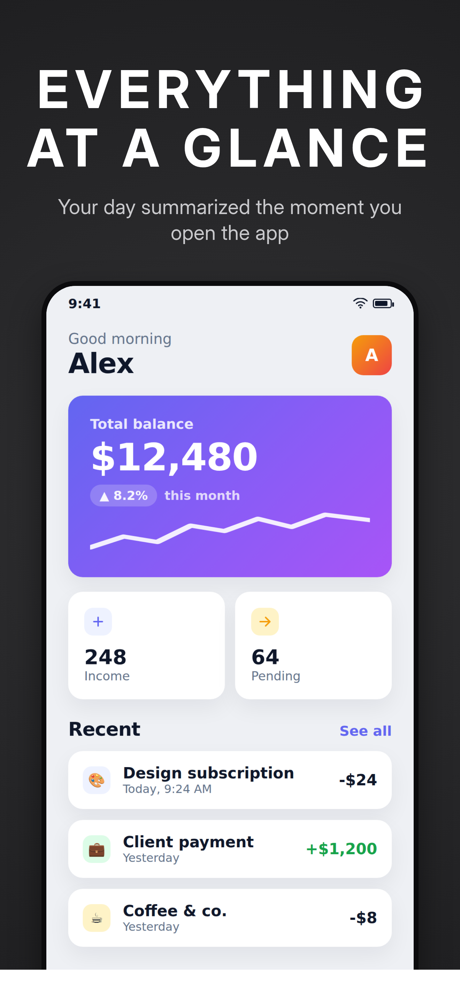

# screengen — App Store / Google Play screenshot generator

Self-hosted CLI that turns ~5 raw app screenshots + caption text into
store-compliant marketing screenshots for every required Apple and Google device
size, in a consistent house style: dark charcoal **vignette** background, large
uppercase white title (+ optional subtitle) near the top, and the app screenshot
in a **stylized device frame** offset downward so it bleeds off the bottom edge.

No accounts, no SaaS. C# / .NET 9 + [SkiaSharp](https://github.com/mono/SkiaSharp).



## Desktop app (GUI)

A WPF editor (`src/ScreenGen.App`) wraps the same rendering core with a **live
preview**: browse for screenshots, edit captions, tweak every style/layout knob
with sliders, pick which targets to generate, and Load/Save the YAML — the preview
pane re-renders as you type.

```sh
dotnet run --project src/ScreenGen.App
```

Or from Visual Studio, set **ScreenGen.App** as the startup project and press F5
(its launch profile runs from the repo root so the default config + sample shots
load automatically). **Generate** writes the same store-compliant files as the CLI.

### Capture from an Android device (adb)

Click **Connect device** in the toolbar to grab screenshots straight from a phone
over USB — no manual file copying:

1. Enable **USB debugging** on the phone and plug it in (authorize the prompt).
2. Click **Connect device**. The dot turns green and shows e.g. "Pixel 7 connected".
3. Navigate to the screen you want on the phone, then capture it (pulled via
   `adb exec-out screencap -p`, saved under `captures/`):
   - **Capture New** adds it as a new screen (ready for a caption). Repeat per screen.
   - **Replace Current** overwrites the selected screen's image (re-shoot a screen
     without losing its caption).

Requires Android **platform-tools** (`adb`); it's auto-located on your PATH, via
`ANDROID_HOME`/`ANDROID_SDK_ROOT`, or in `%LOCALAPPDATA%\Android\Sdk`.

### Hide device chrome (no hint of Android)

Apple rejects screenshots that reveal another platform. The **DEVICE CHROME**
section (config `cleanup:`) paints over the giveaways on the source shot:

- **Hide status bar** — fills a top band over the clock/battery/signal icons.
- **Hide Flutter debug banner** — covers the top-right diagonal `DEBUG` ribbon.
- **Fill** — `auto` samples the pixel just below the status bar to extend a solid
  background/header up over the band (seamless), or set a specific `#RRGGBB`.

It's on by default and applies at render time, so you can dial in the band height
in the live preview (or switch the toggles off if your shots are already clean).
Heights are fractions of the source image, so they scale across targets.

## Quick start (CLI)

```sh
dotnet build
dotnet run --project src/ScreenGen -- generate --config screenshots.yaml --dry-run
dotnet run --project src/ScreenGen -- generate --config screenshots.yaml
```

Output is written under `out/`, mirroring the store folder tree
(`apple/iOS Phones  6.9/01.png`, `android/Android Phones  169/01.png`, …).

### Visual Studio

Config/asset paths resolve against the current working directory, so the included
[launch profiles](src/ScreenGen/Properties/launchSettings.json) set
`workingDirectory` to the repo root. Just pick **Generate (all)** or
**Generate (dry-run)** from the run-profile dropdown and press F5. (Without this,
VS runs in `bin\Debug\...` and you'd get `Config file not found: screenshots.yaml`.)

## CLI

```
screengen generate [options]
screengen --list-targets [--config <f>] [--targets <f>]
screengen --validate-targets [--config <f>] [--targets <f>]

  --config <path>      project config YAML (default: screenshots.yaml)
  --targets <path>     target matrix seed YAML (default: beside config, else bundled)
  --only apple|android render only one store's targets
  --device <name>      render specific target(s); repeatable
  --screen 1,5         render only these source screens (1-based) — fast caption iteration
  --output <dir>       override output.dir
  --dry-run            print the resolved plan (target×screen, sizes, device rect, paths); write nothing
  --list-targets       print the resolved device matrix
  --validate-targets   validate target defs and exit
  -v, --verbose        log layout math while rendering
  -h, --help           show help
```

Exit code is non-zero with a clear message on: missing source image, unknown
target, invalid config/target, or a failed compliance assertion.

## Configuration

A single YAML file per app. Relative paths (fonts, screens, output) resolve
against the **config file's** directory. See [`screenshots.yaml`](screenshots.yaml)
for the fully-commented reference. Key sections:

- `style.background` — `gradient` (center/edge vignette) or `flat` (single color).
- `style.title` / `style.layout` — every position/size is a fraction of canvas
  W/H, so one config drives every resolution. `device_width_pct` scales the whole
  device: small enough fits fully inside the frame, larger bleeds off the bottom.
- `style.frame` — `stylized` (drawn bezel) or `none` (bare rounded screenshot).
  `realistic` is stubbed for the future. The camera cutout (`island`) defaults to
  **`none`** — see the compliance note below.
- `screens` — ordered list of `{image, title, subtitle?}`; order → `01.png … 0N.png`.
- `targets` — which device sizes to render (names from `targets.yaml`).
- `target_defs` — optional inline overrides of any target field.

### Device target matrix is data, not code

The full size list lives in [`targets.yaml`](targets.yaml) (editable seed) and may
be overridden per-project via `target_defs:`. When Apple/Google change their specs,
edit YAML — no code change. `--validate-targets` checks every definition (positive
even dimensions, Google aspect within 1:2..2:1, unique names, valid store/class).

| target | size (W×H) | store | class |
|---|---|---|---|
| `apple_phone_6_9` | 1320×2868 | apple | phone (lead) |
| `apple_phone_6_5` | 1242×2688 | apple | phone |
| `apple_phone_5_5` | 1242×2208 | apple | phone (legacy) |
| `apple_ipad_13` | 2064×2752 | apple | tablet |
| `apple_ipad_12_9` | 2048×2732 | apple | tablet |
| `android_phone` | 1080×1920 | google | phone |
| `android_tablet_7` | 1200×1920 | google | tablet |
| `android_tablet_10` | 1600×2560 | google | tablet |

Required minimum: `apple_phone_6_9` + `apple_ipad_13` (if the app supports iPad) +
`android_phone`. Apple auto-scales the 6.9″ lead size down to smaller iPhones, so
the 6.5″/5.5″ entries are optional.

## Store compliance (enforced)

- **No alpha channel.** Rendering is done on an opaque RGB surface; every PNG is
  asserted to be 24-bit truecolor (color type 2) before it's written — both stores
  reject transparency.
- **Exact pixel dimensions.** Each PNG's IHDR is asserted to equal the target size.
- **Google aspect 1:2..2:1** is validated on Google targets; **file size < 8 MB**.
- Counts (Apple 1–10 per class, Google 2–8 per type) are your responsibility.
- Keep captions free of pricing, "free", and references to other platforms.
- **Camera cutout off by default.** The stylized frame is a generic bezel with no
  Dynamic Island / notch. A drawn cutout is device-identifying and can trip
  Apple's "frame must reflect the actual device" rule — and is simply wrong on the
  6.5″/5.5″ classes, which never had a Dynamic Island. Enable `style.frame.island`
  only if you understand the risk (ideally just on the 6.9″ lead size).

## Screenshot fit

The device frame takes the **target device's aspect ratio** (from its pixel
dimensions), so an iPad target stays iPad-shaped and a phone stays phone-shaped at
any size. The screenshot fills the frame via **cover** — scaled up uniformly,
keeping its own aspect (no distortion, no side bars), pinned to the **top** so only
the bottom overflows and is cropped (the app header stays visible). Note a tall
phone shot in a wide tablet frame loses its bottom — supply tablet-aspect
screenshots for tablet targets, or set a per-target `screen_fit: contain` to
letterbox instead.

The device sits below the title block and bleeds off the bottom.
`device_width_pct` scales the whole device — shrink it to make the device fit fully
inside the frame, enlarge it to bleed off the bottom — and
`title_to_device_gap_pct` sets how far below the title it starts.

## Notes

- **Fonts**: `style.font.title` / `style.font.subtitle` accept either a **font
  file path** (.ttf/.otf) or an **installed font-family name** (e.g. `Inter`,
  `Montserrat`). The desktop app's FONTS section lists installed families and has
  a file browser. An OFL Inter variable font is bundled in `assets/fonts/` as the
  default. SkiaSharp 3.x removed the variable-axis API, so a variable font loads
  at its default instance and `title_weight >= 600` is approximated by emboldening
  at draw time; use a static-weight file/family for precise control. Resolution
  order: file path → installed family → bundled font → system default (warns).
- **CLI parsing** is hand-rolled (no `System.CommandLine` dependency) for a stable,
  dependency-light surface.

## Project layout

```
src/ScreenGen/        Program.cs (CLI), Config, Targets, Layout, Renderer, Frames/
src/ScreenGen.App/    WPF desktop editor (live preview) reusing the core
targets.yaml          editable seed device matrix
screenshots.yaml      example project config (generic Demo App)
assets/fonts/         bundled Inter variable font
shots/                sample raw screenshots
tests/ScreenGen.Tests xUnit compliance + validation tests
```

## Tests

```sh
dotnet test
```

Asserts exact dimensions, no-alpha, Google aspect, and file size on rendered
output, plus target-validator behavior.
